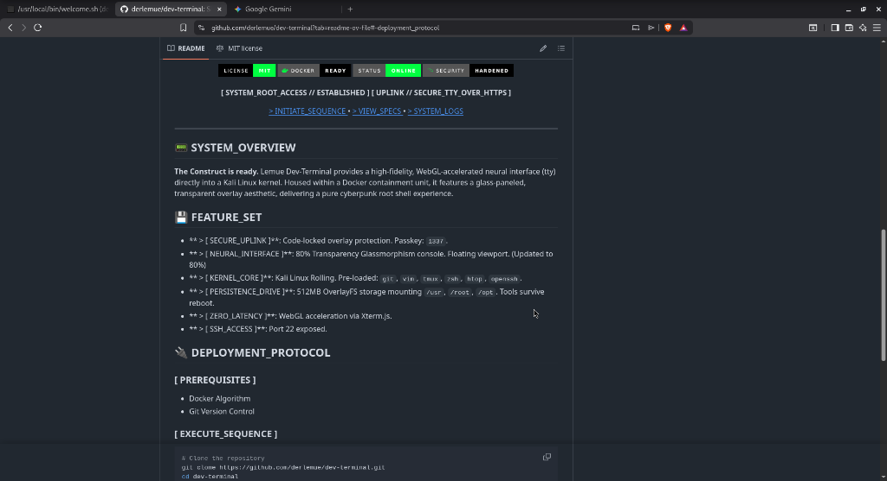

<div align="center">



# 🟢 **LEMUE // DEV-TERMINAL** `v2.0.18`


**[ SYSTEM_ROOT_ACCESS // ESTABLISHED ]**
**[ UPLINK // SECURE_HTTPS_BASIC_AUTH ]**

[ > INITIATE_SEQUENCE ](#deployment) • [ > VIEW_SPECS ](#features) • [ > INTELLIGENCE ](#intelligence)

</div>

---

## <a id="overview"></a> 📟 SYSTEM_OVERVIEW

**The Construct has evolved.**
Dev-Terminal v2.0.0 provides a production-grade, encrypted pentesting environment. Housed within a Docker containment unit, it features a glass-paneled, transparent overlay aesthetic, delivering a pure cyberpunk root shell experience with fully encrypted persistence.

## <a id="features"></a> 💾 FEATURE_SET

- **[ ENCRYPTED_CORE ]**: **LUKS** Encrypted Persistence (2GB) for `/usr`, `/root`, `/opt`, `/home`.
- **[ SECURE_ACCESS ]**: Server-Side **Basic Auth** (HTTPS Safe). Configurable via `.env`.
- **[ NEURAL_INTERFACE ]**: 70% Transparency Glassmorphism console. Borderless.
- **[ TOOL_SUITE ]**: Pre-loaded: `nmap`, `docker`, `ssh`, `cryptsetup`, `tracepath`, `bashtop`.
- **[ SSH_UPLINK ]**: Port `2222` exposed (PermitRootLogin enabled).
- **[ SYSTEM_USER ]**: User `lemue` configured with `sudo` and `docker` rights.

## <a id="intelligence"></a> 🧠 INTELLIGENCE_DATA

> [!TIP]
> **Training Modules Loaded**


- **[ VIDEO_LOG ]**: [Watch Terminal Feed](https://derlemue.github.io/dev-terminal/docs/terminal_log.html)
- **[ REPORT_INTERACTIVE_DE ]**: [Interactive Report (German)](https://derlemue.github.io/dev-terminal/docs/report.html)
- **[ REPORT_INTERACTIVE_EN ]**: [Interactive Report (English)](https://derlemue.github.io/dev-terminal/docs/report-EN.html)
- **[ REPORT_DE_PDF ]**: [Download Report (DE) .pdf](docs/report.pdf)
- **[ REPORT_DE_MD ]**: [Read Report (DE) .md](docs/report.md)
- **[ REPORT_EN_PDF ]**: [Download Report (EN) .pdf](docs/report-EN.pdf)
- **[ REPORT_EN_MD ]**: [Read Report (EN) .md](docs/report-EN.md)
- **[ SYSTEM_INFO ]**: [View Spec Sheet](https://derlemue.github.io/dev-terminal/docs/info.html)
- **[ FLASHCARDS ]**: [Access Neural Training](https://gemini.google.com/share/32b3c1c475da)
- **[ QUIZ_MODULE ]**: [Test Competency](https://gemini.google.com/share/8efae68b5354)

## <a id="deployment"></a> 🔌 DEPLOYMENT_PROTOCOL

### [ PREREQUISITES ]
- Docker Engine & Docker Compose
- Git Version Control

### [ EXECUTE_SEQUENCE ]
### [ EXECUTE_SEQUENCE ]
```bash
# Clone the repository
git clone https://github.com/derlemue/dev-terminal.git
cd dev-terminal

# Run Auto-Installer (Generates Volume & Config)
./setup.sh
```

- **[ ACCESS_POINT ]**: [`http://localhost:7681`](http://localhost:7681)
- **[ SSH_UPLINK ]**: `ssh -p 2222 lemue@localhost`

## <a id="manual"></a> 🕹️ OPERATOR_MANUAL

1. Jack in to `http://localhost:7681`.
2. Authenticate using credentials from `.env` (Default: `lemueIO` / `lemueIO`).
3. You are **lemue** (sudoer).

## 🏗️ SYSTEM_ARCHITECTURE

The matrix is built on four layers:
1.  **Host:** Docker Container (Kali Rolling).
2.  **Encryption:** LUKS Volume (Aes-xts-plain64) mounted via Loop.
3.  **Persistence:** OverlayFS merging Encrypted Volume + Ephemeral Container.
4.  **Interface:** `ttyd` (v1.7.7-patched) with Basic Auth & Custom Visuals.

---
<div align="center">
[ END_OF_LINE ]<br>
Crafted by <a href="https://github.com/derlemue">Lemue</a>
</div>
